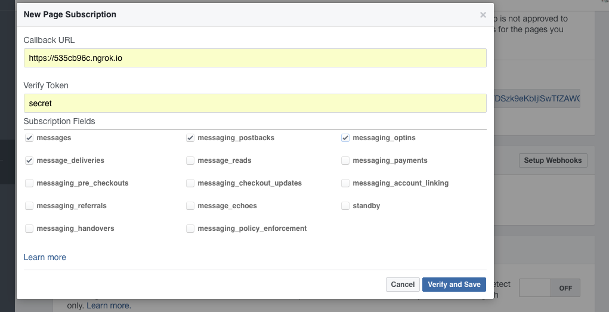

## Facebook Messenger Chat for Starters


#### Install Dependencies

Install Flask & requests packages using `pip`:

```
pip install Flask requests
```

Install ngrok from - <a href="https://ngrok.com/">https://ngrok.com/</a>.


#### Run Server & Tunnel Connection

Run the dev server using: 

```
python server.py
```

Use `ngrok` to tunnel the connection; 

```
./ngrok http 5000
```

You will see the url for your local server. Something like: `https://6cecffb8.ngrok.io`. 


#### Setup Facebook App & Access Token (snapshots coming soon!)

* Create a Facebook App from [Facebook Developer Website](https://developers.facebook.com/).


* Set Up the `Messenger` Product (you should have a Facebook Page link your bot with).


* Select a page and enable webhooks. Use the above URL as the callback webhook URL (it should be `https`).


* Edit `server.py` and update the `VERIFY_TOKEN`(you set, in this case "secret") & `ACCESS_TOKEN`(randomly generated token).


* Once the callback is verified, subscribe the app to one of your pages to activate the bot.


* Also generate a page access token for that page.


* Edit `server.py` and update the `ACCESS_TOKEN` with the new token we got.


### Testing the bot

Visit your Facebook Page to chat with the bot. Make sure to follow all the steps above in order for the bot to 
be activated on your Facebook Page. :+1: